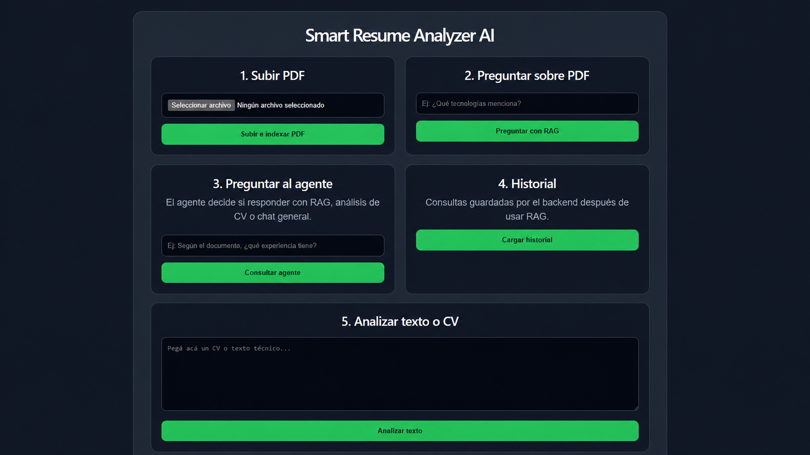

# 🚀 Smart Resume Analyzer AI

Sistema de análisis inteligente de documentos y CVs utilizando **FastAPI**, **LangChain**, **LangGraph**, **Ollama**, **RAG** y **ChromaDB**.

El proyecto permite subir documentos PDF, indexarlos mediante embeddings, responder preguntas utilizando Retrieval-Augmented Generation (RAG), analizar currículums con IA y gestionar las consultas a través de un agente construido con LangGraph.

---

# 📸 Demo

## Frontend
<h3 align="center">Smart Resume Analyzer</h3>

<p align="center">
  
</p>

## Swagger

http://localhost:8000/docs

---

# 🎯 Objetivos

- Construir una API moderna utilizando FastAPI.
- Integrar Large Language Models mediante Ollama.
- Implementar una arquitectura RAG.
- Utilizar LangChain y LangGraph.
- Implementar AI Agents.
- Persistir el historial de consultas.
- Aplicar buenas prácticas de arquitectura de software.

---

# 🛠 Tecnologías

## Backend

- Python 3.13
- FastAPI
- SQLAlchemy
- SQLite (fácilmente migrable a PostgreSQL)

## Inteligencia Artificial

- LangChain
- LangGraph
- Ollama
- Llama 3.2
- nomic-embed-text

## RAG

- ChromaDB
- Embeddings
- Recursive Text Splitter
- Similarity Search

## Frontend

- React
- Vite
- Axios

## DevOps

- Docker
- Docker Compose

---

# 🏛 Arquitectura

```text
                    React
                      │
                      ▼
                 FastAPI API
                      │
              LangGraph Agent
          ┌───────────┼───────────┐
          │           │           │
          ▼           ▼           ▼
     Resume Tool   RAG Tool   General Tool
          │           │           │
          ▼           ▼           ▼
      LangChain   ChromaDB    Ollama
                      │
                 Embeddings
                      │
              nomic-embed-text
```

---

# 📁 Estructura

```text
app
│
├── agents
├── api
│   └── routes
├── chains
├── config
├── database
├── models
├── rag
├── repositories
├── schemas
├── services
├── tools
├── utils
├── main.py
│
tests
Dockerfile
docker-compose.yml
README.md
```

---

# ⚙️ Instalación

## Clonar repositorio

```bash
git clone https://github.com/tuusuario/smart-resume-analyzer-ai.git

cd smart-resume-analyzer-api
```

---

## Crear entorno virtual

Windows

```bash
python -m venv venv

venv\Scripts\activate
```

Linux

```bash
python3 -m venv venv

source venv/bin/activate
```

---

## Instalar dependencias

```bash
pip install -r requirements.txt
```

---

## Descargar modelos

```bash
ollama pull llama3.2

ollama pull nomic-embed-text
```

---

## Ejecutar Backend

```bash
uvicorn app.main:app --reload
```

Swagger

```
http://localhost:8000/docs
```

---

## Ejecutar Frontend

```bash
npm install

npm run dev
```

---

# 🐳 Docker

Construir

```bash
docker compose up --build
```

---

# 📄 Flujo RAG

```text
PDF

↓

PyPDFLoader

↓

Text Splitter

↓

Embeddings

↓

ChromaDB

↓

Similarity Search

↓

LLM

↓

Respuesta
```

---

# 🤖 AI Agent

El agente utiliza LangGraph para decidir qué herramienta utilizar.

```text
                 Pregunta

                     │

         ¿Es sobre un PDF?

             Sí            No

             │              │

             ▼              ▼

           RAG        ¿Es un CV?

                       │

             Sí               No

             │                 │

             ▼                 ▼

      Resume Tool      General Tool
```

---

# 📚 Endpoints

## Analizar texto

```
POST /api/analyze
```

---

## Subir PDF

```
POST /api/upload
```

---

## Preguntar al documento

```
POST /api/ask
```

---

## AI Agent

```
POST /api/agent
```

---

## Historial

```
GET /api/history
```

---

## Health Check

```
GET /api/health
```

---

# 📂 Ejemplo

Subir PDF

```
manual_fastapi_ai.pdf
```

Preguntar

```
¿Qué tecnologías menciona el documento?
```

Respuesta

```
FastAPI
Docker
Python
LangChain
RAG
```

---

# 🧪 Testing

Ejecutar

```bash
pytest
```

---

# 🔒 Buenas prácticas implementadas

- Arquitectura por capas
- Repository Pattern
- Dependency Separation
- Logging
- Global Exception Handler
- Configuración mediante .env
- Docker
- SQLAlchemy
- AI Agents
- LangGraph
- RAG
- Embeddings
- ChromaDB

---

# 🚀 Mejoras futuras

- PostgreSQL
- Azure OpenAI
- Azure AI Search
- Redis Cache
- JWT Authentication
- Usuarios y Roles
- Multi Agents
- Semantic Search
- Evaluación automática de respuestas
- Streaming de respuestas
- Observabilidad con OpenTelemetry

---

# 👨‍💻 Autor

**Franco Martín Sassi**

Software Developer | AI Engineer

- LinkedIn: https://linkedin.com/in/sassifranco
- GitHub: https://github.com/Franco97sassi
- Portfolio: https://portfoliofranco-sassi.vercel.app

---

# ⭐ Si este proyecto te resulta útil

¡Dejale una estrella al repositorio!